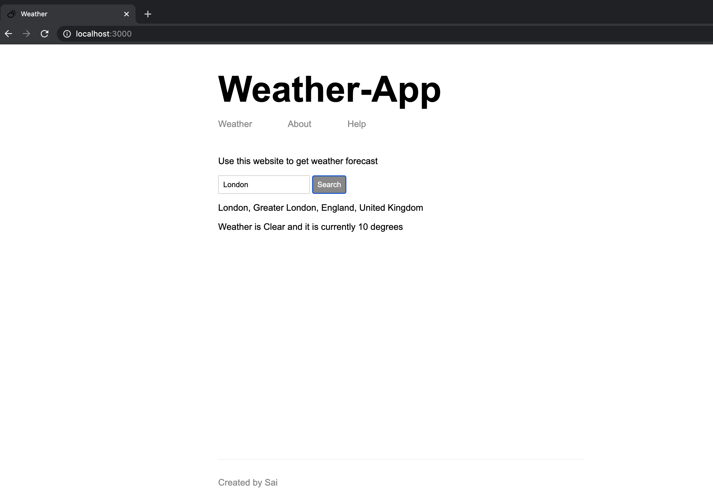

# Real-Time Weather-App

This is weather app built using Node JS . It renders the weather of any location by calling two third party apis .It is also full stack node JS application since both Front end and backend for this app is supported by Node JS

##  Screenshot of app

